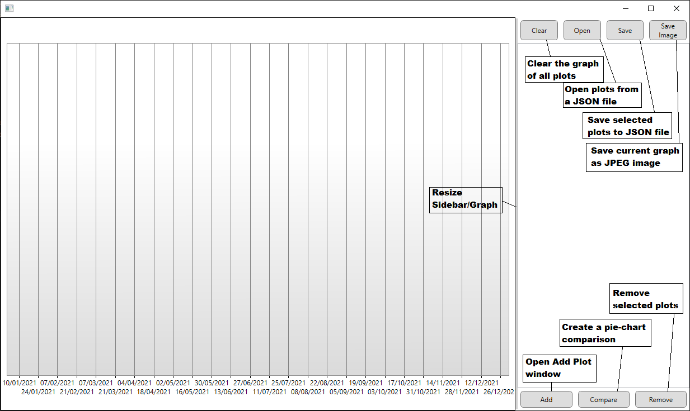
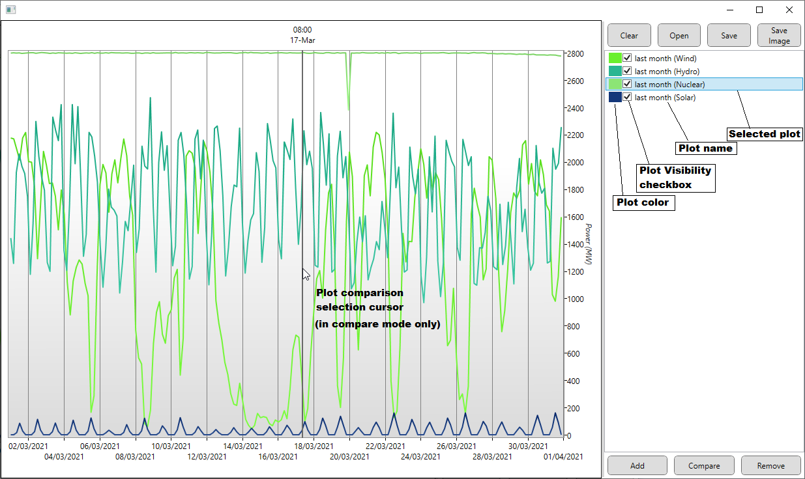
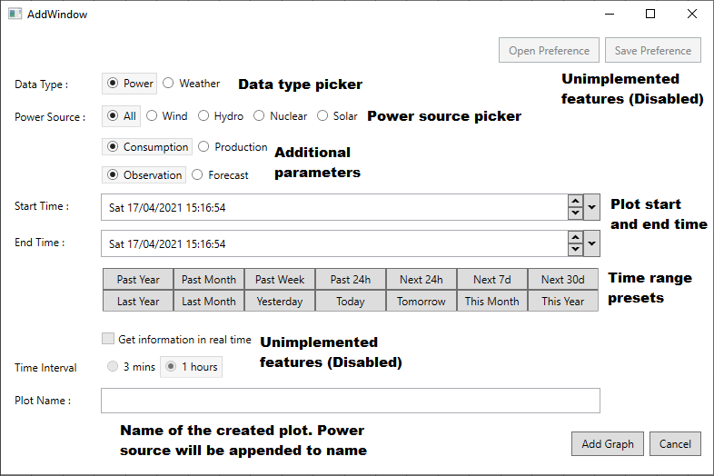
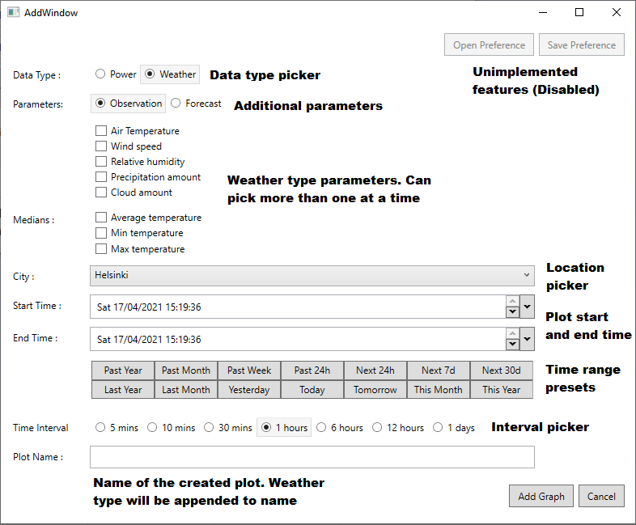

# Weather and Power

## Prerequisite
The user must first create an Environment Variable on their computer which has a valid Fingrid API.
The name for the environment variable is listed in the Environemnt Variables section of this README
Fingrid API can be acquired here: https://data.fingrid.fi/open-data-forms/registration/

## How to run
The solution can either be built and debugged using Visual Studio 2019, or one can run the program with
the pre-built binaries included in https://course-gitlab.tuni.fi/comp-se-110-software-design_2020-2021/team-17/-/blob/master/WeatherAndPower/WeatherAndPower/bin/Release/

Run the executable to start the program.

## Instructions
The main UI of the program looks like this:

The primary UI of the program is on the left.

### Buttons:
- Clear: Clears graph of all plots
- Open: Load plots from a JSON file
- Save: Save selected plots to JSON file
- Save Image: Save current graph to JSON file
- Add: Open Add Window (more on this later)
- Compare: Create plot comparison (more on this later too)
- Remove: Remove selected plots from the graph completely

## The Add Window
The add window has two tabs. One for adding Power data and one for adding Weather data

### Power data

### Weather data

### Usage
select the desired properties and click Add Graph

## Compare functionality
The program has the ability to compare the percentage of power production.
Only power graphs with a specific source, like wind/nuclear/solar/hydro are comparable. All other plots will be ignored.
There must be at least one comparable plot in the graph to create a comparison

### Usage
When the user presses the "Compare" button, they will be prompted to select a time in the graph at which to compare.
When the time is selected by clicking on the graph, a new window will pop up with the resulting comparison as a pie chart.

# Other
### On selecting plots
plots can be selected either by clicking on them in the list on the left, or by clicking on the plot in the graph.
Multiple plots can be selected at a time by holding CTRL while selecting.
**Note: The plot visibility checkbox is *not* how you select plots. Plot visibility has no effect on if they are selected or not.**

### On creating comparisons
There must be valid comparable plots in the graph to create a comparison. If there are comparable plots in the graph but the date time picked by the user as the point of comparison does not have data from those plots, a comparison will not be possible.

# Environment Variables
Here are the required environment variables and their name:
- FINGRID_API: API key for authenticating Fingrid API

